# 校园线上订餐系统
*七校联合办学最后一届双学位进修道友的系统性挣扎*

[TOC]

## 需求
<!-- 自己瞎给的 -->

### 目的
- 要开发的一款面向大学生在食堂订餐的外卖软件产品；
- 软件将完成与食堂系统对接，用户点餐，食堂出餐，同学兼职外卖送餐等功能；
- 实现食堂高峰期分流，收益主要来自于订单的分红。

### 用例
主要分为三个功能子系统：**订餐子系统、配餐子系统、服务反馈子系统**
用例图如下：

#### 订餐子系统
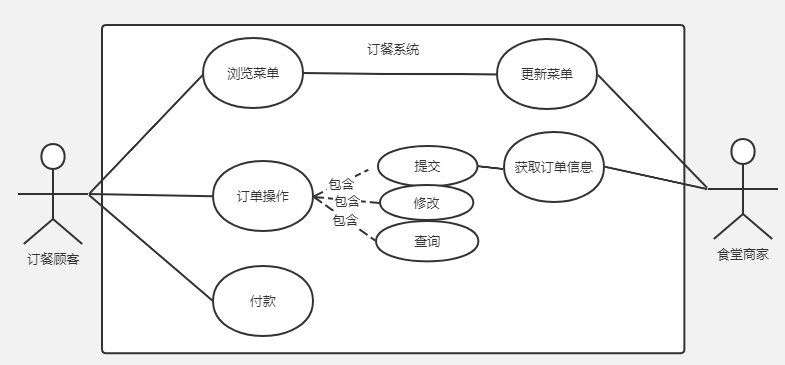

#### 配餐子系统

#### 服务反馈子系统

## 总览

py依赖包配置：
'''
pip install -r packages.txt
'''

### 架构思路

> 理想很丰满但现实很骨感

面向功能的搭建系统不太容易，因此我们采用面向服务对象的方法重新进行进行架构。

#### 数据流

系统架构图如下：
<!-- 汤少nb，思维缜密，作图细致。数据流图画的真好，就是兄弟们水平太差 -->
##### 顶层

##### 第一层
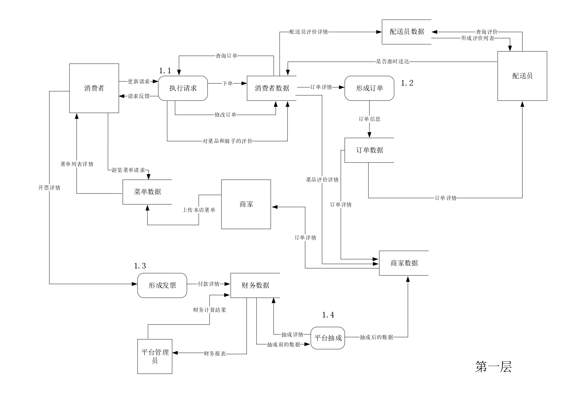
##### 第二层

**顾客**
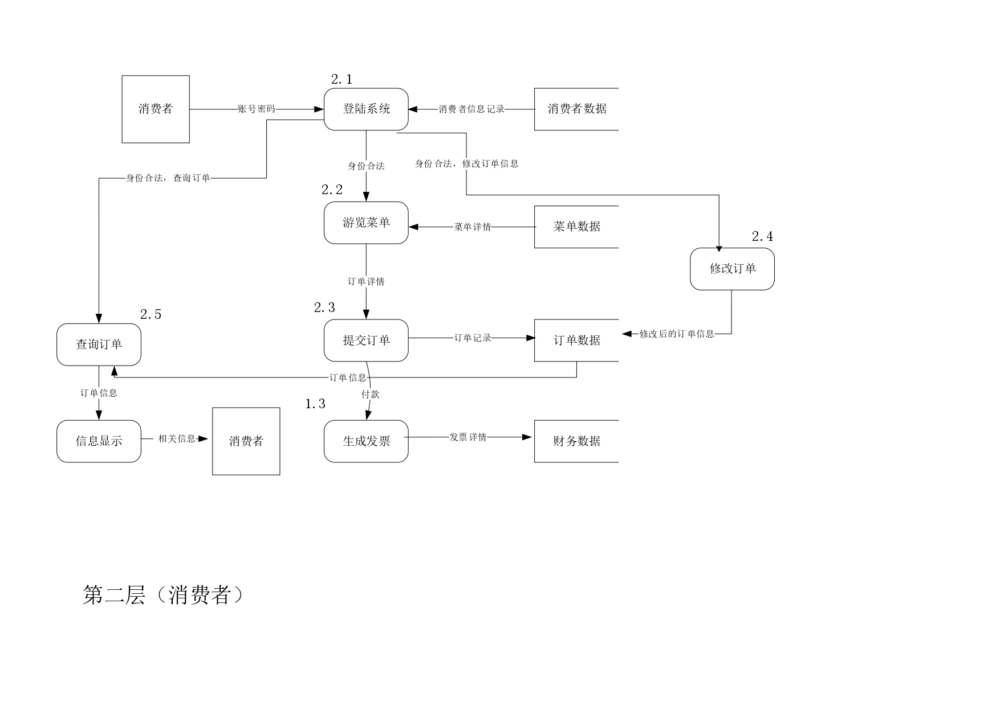

**商家**
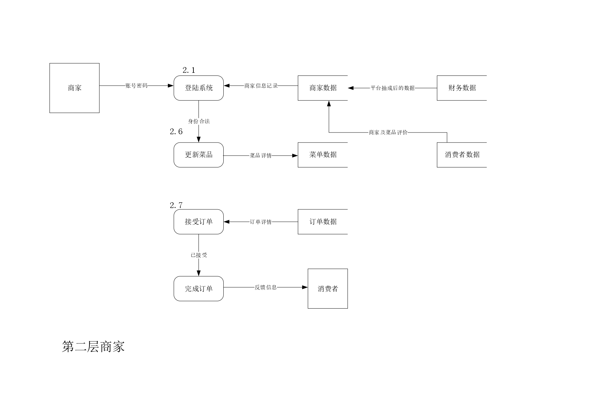

**送餐员**
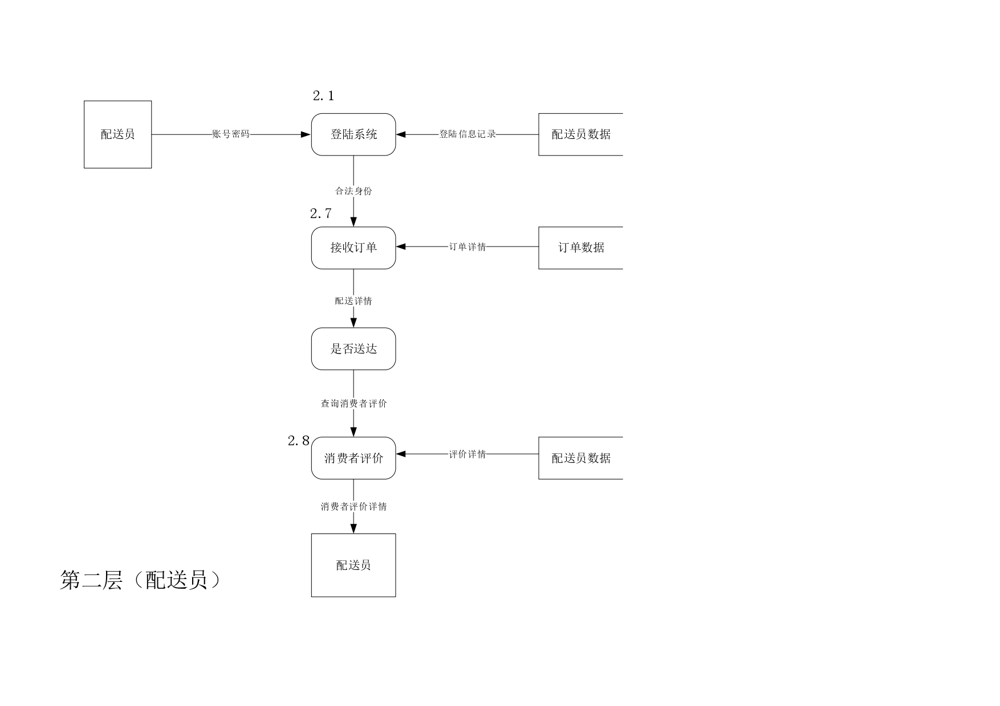

**管理员**
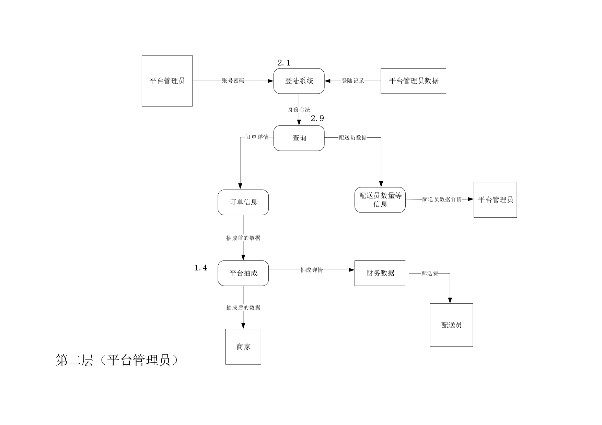

数据字典就不列了，上面这图已经够唬人了*(逃逃逃)*

### 软件结构

#### 软件结构图

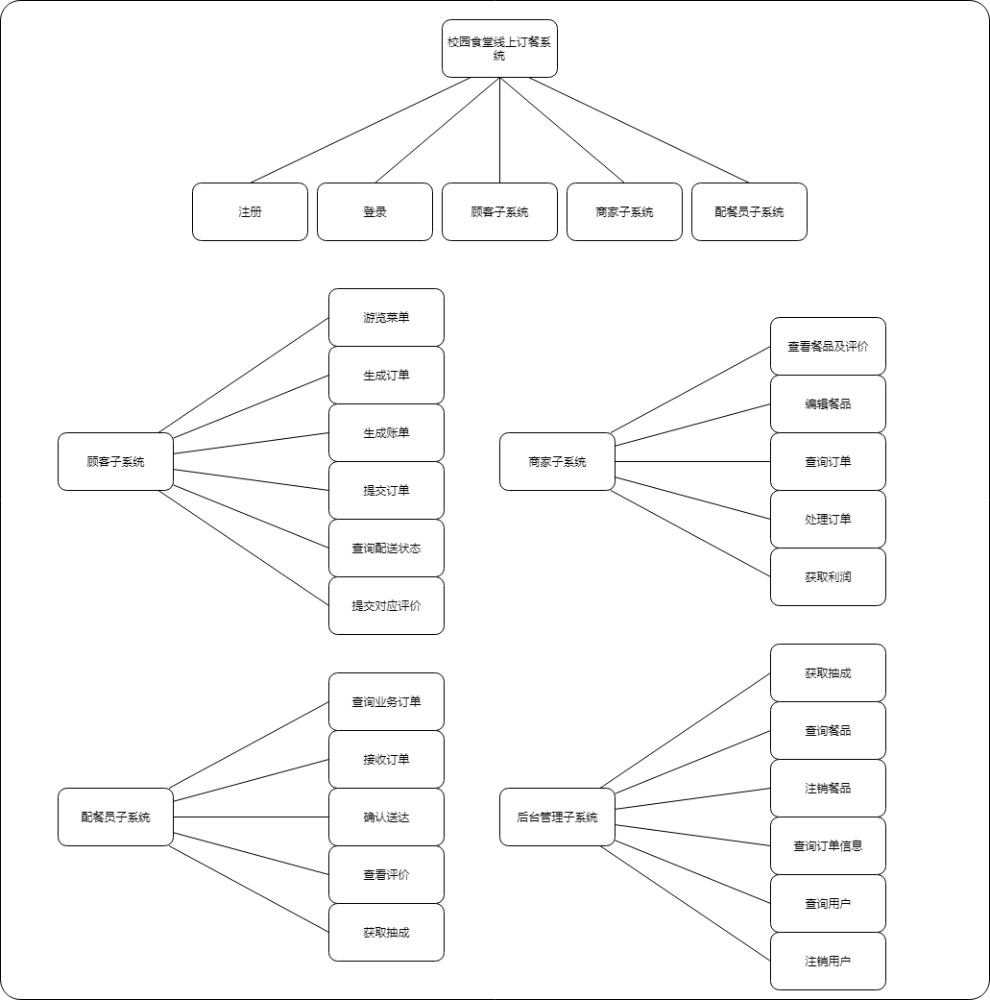

#### 实体关系图

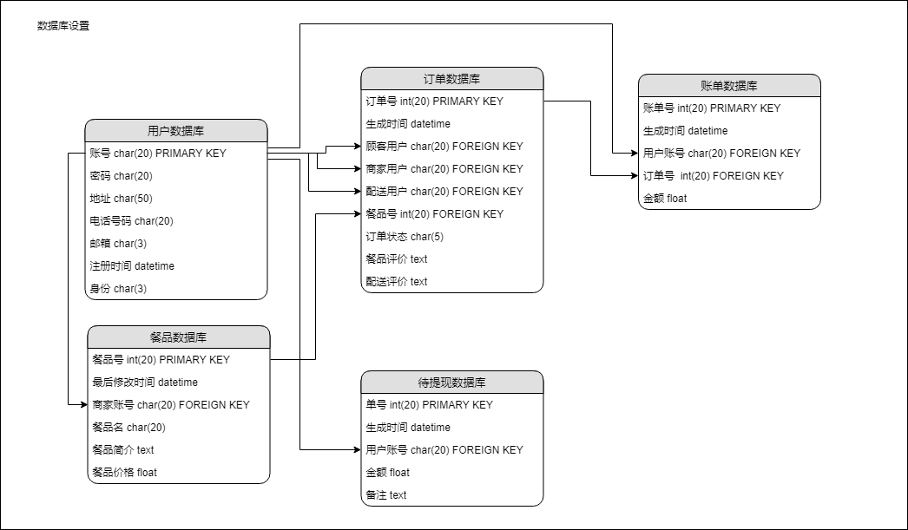

#### 页面跳转图

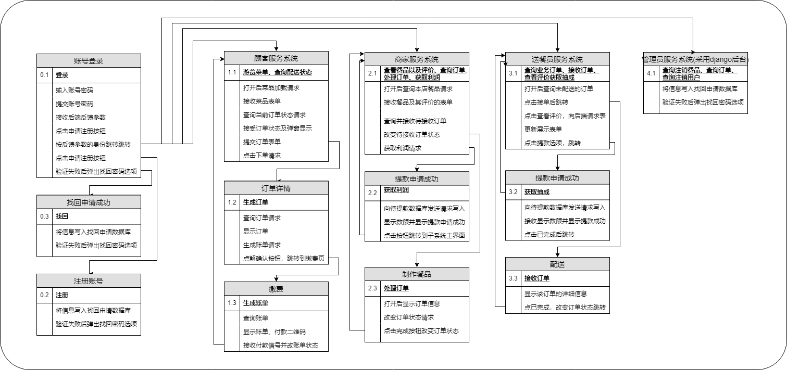

#### 原型图

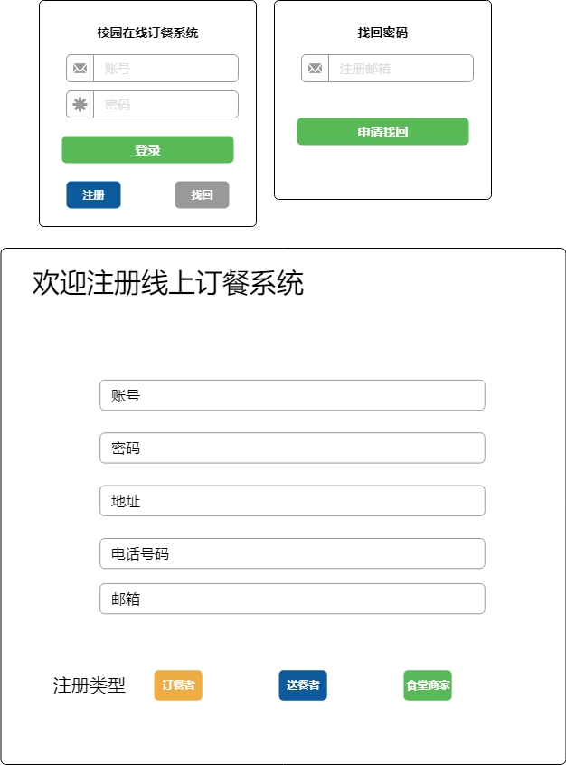

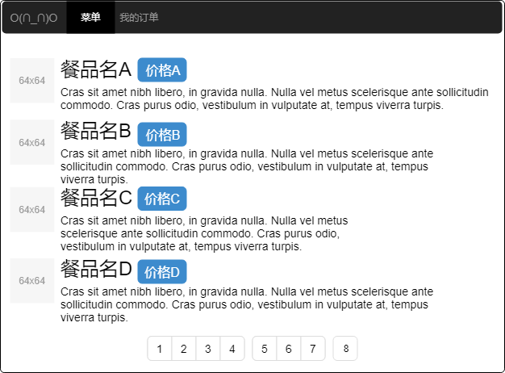

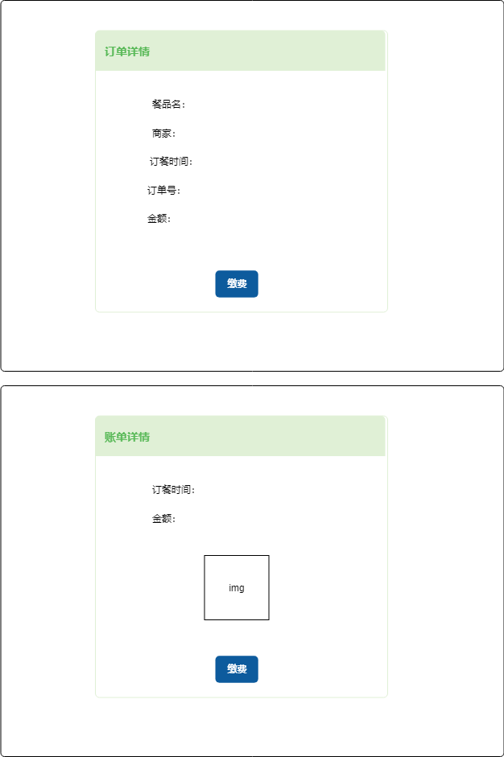

==未完待续继续肝==

## 顾客子系统

## 商家子系统

## 送餐员子系统

## 附注

